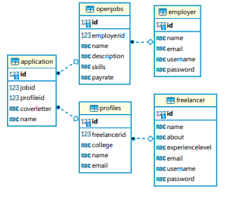

# RevWork-API

## FlowChart

## ER-Diagram

## Description

With RevWork API Employers and Freelancers each have their privalages and use cases.
#### Employers Are Able To
 - Register/Login
 - Post/View Jobs
 - Edit/Delete Jobs
 - View Applicants/Applicant
 #### Freelancers Are Able To
 - Register/Login
 - Create/Edit/Delete Profiles
 - View Profiles/Profile
 - Submit Applications to Jobs
 - View Jobs/Job

## API Documentation

## Front End

- link 

## Authors
- [Michael B.](https://github.com/NewPagodi)
- [James F.](https://github.com/Fullerj289)
- [Franklyn S.](https://github.com/fsanche3)

